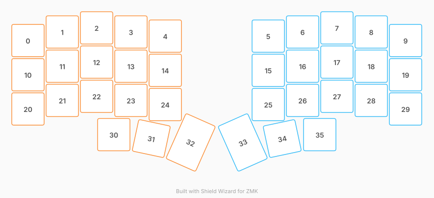

# ZMK Configuration for cygnus

*Generated by Shield Wizard for ZMK*



Download compiled firmware from the Actions tab. <https://zmk.dev/docs/user-setup#installing-the-firmware>

Edit your keymap <https://zmk.dev/docs/keymaps>.
User keymap is located at [`config/cygnus.keymap`](config/cygnus.keymap).

-----

<details>
<summary>
Shield Wizard Debug Information
</summary>

In case of broken configuration, here is the Shield Wizard internal data used to generate this configuration:

Commit: c6078aab2a34eefa8ab8d00f2fc656779fdcfa46

```json
{"name":"cygnus","shield":"cygnus","dongle":false,"modules":[],"layout":[{"id":"01KZW8CZPXRPF2TY1B1P6T501K","part":0,"row":0,"col":0,"w":1,"h":1,"x":0,"y":0.37,"r":0,"rx":0,"ry":0},{"id":"01KZW8CZPX3ASD8JDVD4VVAT9F","part":0,"row":0,"col":1,"w":1,"h":1,"x":1,"y":0.12,"r":0,"rx":0,"ry":0},{"id":"01KZW8CZPXQ435QFJVJQP5K1W9","part":0,"row":0,"col":2,"w":1,"h":1,"x":2,"y":0,"r":0,"rx":0,"ry":0},{"id":"01KZW8CZPXXR5H8472JDSFFR6Y","part":0,"row":0,"col":3,"w":1,"h":1,"x":3,"y":0.12,"r":0,"rx":0,"ry":0},{"id":"01KZW8CZPX1DFKBQN24R9HK1XC","part":0,"row":0,"col":4,"w":1,"h":1,"x":4,"y":0.24,"r":0,"rx":0,"ry":0},{"id":"01KZW8CZPXRZ2BCM71TRVSWYET","part":1,"row":0,"col":5,"w":1,"h":1,"x":7,"y":0.24,"r":0,"rx":0,"ry":0},{"id":"01KZW8CZPXWGC6HC76K1VB43BM","part":1,"row":0,"col":6,"w":1,"h":1,"x":8,"y":0.12,"r":0,"rx":0,"ry":0},{"id":"01KZW8CZPX6D0E1QGF88JNXJ73","part":1,"row":0,"col":7,"w":1,"h":1,"x":9,"y":0,"r":0,"rx":0,"ry":0},{"id":"01KZW8CZPXB0GB86W8TG8EVBD2","part":1,"row":0,"col":8,"w":1,"h":1,"x":10,"y":0.12,"r":0,"rx":0,"ry":0},{"id":"01KZW8CZPXZ4JB3R3JYCJJHRTJ","part":1,"row":0,"col":9,"w":1,"h":1,"x":11,"y":0.37,"r":0,"rx":0,"ry":0},{"id":"01KZW8CZPXQ2HWXXDS2W9YS10B","part":0,"row":1,"col":0,"w":1,"h":1,"x":0,"y":1.37,"r":0,"rx":0,"ry":0},{"id":"01KZW8CZPXHNP554EF34P07DVP","part":0,"row":1,"col":1,"w":1,"h":1,"x":1,"y":1.12,"r":0,"rx":0,"ry":0},{"id":"01KZW8CZPYP3KW40KWVC4V9EC6","part":0,"row":1,"col":2,"w":1,"h":1,"x":2,"y":1,"r":0,"rx":0,"ry":0},{"id":"01KZW8CZPYE48VH7YPE9J876B9","part":0,"row":1,"col":3,"w":1,"h":1,"x":3,"y":1.12,"r":0,"rx":0,"ry":0},{"id":"01KZW8CZPYS4ATX2N996VB7D1G","part":0,"row":1,"col":4,"w":1,"h":1,"x":4,"y":1.24,"r":0,"rx":0,"ry":0},{"id":"01KZW8CZPY16KBA8RDKD21V2PS","part":1,"row":1,"col":5,"w":1,"h":1,"x":7,"y":1.24,"r":0,"rx":0,"ry":0},{"id":"01KZW8CZPYAVQRD8SAPRMJYQVE","part":1,"row":1,"col":6,"w":1,"h":1,"x":8,"y":1.12,"r":0,"rx":0,"ry":0},{"id":"01KZW8CZPY1RE8VQ82XFETTF65","part":1,"row":1,"col":7,"w":1,"h":1,"x":9,"y":1,"r":0,"rx":0,"ry":0},{"id":"01KZW8CZPY9KCQPSMS7B1B9BA4","part":1,"row":1,"col":8,"w":1,"h":1,"x":10,"y":1.12,"r":0,"rx":0,"ry":0},{"id":"01KZW8CZPY9KNTS19ZXTFK0WV9","part":1,"row":1,"col":9,"w":1,"h":1,"x":11,"y":1.37,"r":0,"rx":0,"ry":0},{"id":"01KZW8CZPYS8TDRAZG877CBXSK","part":0,"row":2,"col":0,"w":1,"h":1,"x":0,"y":2.37,"r":0,"rx":0,"ry":0},{"id":"01KZW8CZPYA9FGQANGH63VZ3K7","part":0,"row":2,"col":1,"w":1,"h":1,"x":1,"y":2.12,"r":0,"rx":0,"ry":0},{"id":"01KZW8CZPY333R37RS1FJYDD16","part":0,"row":2,"col":2,"w":1,"h":1,"x":2,"y":2,"r":0,"rx":0,"ry":0},{"id":"01KZW8CZPY6B18MJPWFCG7WKW2","part":0,"row":2,"col":3,"w":1,"h":1,"x":3,"y":2.12,"r":0,"rx":0,"ry":0},{"id":"01KZW8CZPY0F29W6QT9W443RW2","part":0,"row":2,"col":4,"w":1,"h":1,"x":4,"y":2.24,"r":0,"rx":0,"ry":0},{"id":"01KZW8CZPYJ6EVWMFKCV2KE9P7","part":1,"row":2,"col":5,"w":1,"h":1,"x":7,"y":2.24,"r":0,"rx":0,"ry":0},{"id":"01KZW8CZPYWMN1T6MD4F7KKDXS","part":1,"row":2,"col":6,"w":1,"h":1,"x":8,"y":2.12,"r":0,"rx":0,"ry":0},{"id":"01KZW8CZPYVWNYWFBP2XFYRT7B","part":1,"row":2,"col":7,"w":1,"h":1,"x":9,"y":2,"r":0,"rx":0,"ry":0},{"id":"01KZW8CZPYZ9Z1RVCANN7GZ8MZ","part":1,"row":2,"col":8,"w":1,"h":1,"x":10,"y":2.12,"r":0,"rx":0,"ry":0},{"id":"01KZW8CZPY2V6V5TEDVHF1AJ6W","part":1,"row":2,"col":9,"w":1,"h":1,"x":11,"y":2.37,"r":0,"rx":0,"ry":0},{"id":"01KZW8CZPYJWHARAJ7J4KFW5QV","part":0,"row":3,"col":2,"w":1,"h":1,"x":2.5,"y":3.12,"r":0,"rx":0,"ry":0},{"id":"01KZW8CZPYTQ5AFQP4E9GDWCYG","part":0,"row":3,"col":3,"w":1,"h":1,"x":3.5,"y":3.12,"r":12,"rx":3.5,"ry":4.12},{"id":"01KZW8CZPYMCEMH160PGZJRFHV","part":0,"row":3,"col":4,"w":1,"h":1.5,"x":4.48,"y":2.83,"r":24,"rx":4.48,"ry":4.33},{"id":"01KZW8CZPYSDTR4FS3G2ATKB12","part":1,"row":3,"col":5,"w":1,"h":1.5,"x":6.52,"y":2.83,"r":-24,"rx":7.52,"ry":4.33},{"id":"01KZW8CZPYDYW3XFVYG92N0041","part":1,"row":3,"col":6,"w":1,"h":1,"x":7.5,"y":3.12,"r":-12,"rx":8.5,"ry":4.12},{"id":"01KZW8CZPYJG4SN4158CXP8KBY","part":1,"row":3,"col":7,"w":1,"h":1,"x":8.5,"y":3.12,"r":0,"rx":0,"ry":0}],"parts":[{"name":"left","controller":"nice_nano_v2","pins":{"d1":{"usage":"kscan","kscan":"01KZW8G83AHZ4W917SGGA8R199","role":"output"},"d0":{"usage":"kscan","kscan":"01KZW8G83AHZ4W917SGGA8R199","role":"output"},"d2":{"usage":"kscan","kscan":"01KZW8G83AHZ4W917SGGA8R199","role":"output"},"d3":{"usage":"kscan","kscan":"01KZW8G83AHZ4W917SGGA8R199","role":"output"},"d4":{"usage":"kscan","kscan":"01KZW8G83AHZ4W917SGGA8R199","role":"output"},"d5":{"usage":"kscan","kscan":"01KZW8G83AHZ4W917SGGA8R199","role":"input"},"d6":{"usage":"kscan","kscan":"01KZW8G83AHZ4W917SGGA8R199","role":"input"},"d7":{"usage":"kscan","kscan":"01KZW8G83AHZ4W917SGGA8R199","role":"input"},"d8":{"usage":"kscan","kscan":"01KZW8G83AHZ4W917SGGA8R199","role":"input"}},"kscans":[{"kind":"matrix","id":"01KZW8G83AHZ4W917SGGA8R199","diodes":true}],"keys":{"01KZW8CZPXRPF2TY1B1P6T501K":{"input":"d5","output":"d1"},"01KZW8CZPXQ2HWXXDS2W9YS10B":{"input":"d6","output":"d1"},"01KZW8CZPYS8TDRAZG877CBXSK":{"input":"d7","output":"d1"},"01KZW8CZPX3ASD8JDVD4VVAT9F":{"input":"d5","output":"d0"},"01KZW8CZPXHNP554EF34P07DVP":{"input":"d6","output":"d0"},"01KZW8CZPYA9FGQANGH63VZ3K7":{"input":"d7","output":"d0"},"01KZW8CZPXQ435QFJVJQP5K1W9":{"input":"d5","output":"d2"},"01KZW8CZPYP3KW40KWVC4V9EC6":{"input":"d6","output":"d2"},"01KZW8CZPY333R37RS1FJYDD16":{"input":"d7","output":"d2"},"01KZW8CZPXXR5H8472JDSFFR6Y":{"input":"d5","output":"d3"},"01KZW8CZPYE48VH7YPE9J876B9":{"input":"d6","output":"d3"},"01KZW8CZPY6B18MJPWFCG7WKW2":{"input":"d7","output":"d3"},"01KZW8CZPYJWHARAJ7J4KFW5QV":{"input":"d8","output":"d2"},"01KZW8CZPX1DFKBQN24R9HK1XC":{"input":"d5","output":"d4"},"01KZW8CZPYS4ATX2N996VB7D1G":{"input":"d6","output":"d4"},"01KZW8CZPY0F29W6QT9W443RW2":{"input":"d7","output":"d4"},"01KZW8CZPYTQ5AFQP4E9GDWCYG":{"input":"d8","output":"d3"},"01KZW8CZPYMCEMH160PGZJRFHV":{"input":"d8","output":"d4"}},"encoders":[],"buses":{}},{"name":"right","controller":"nice_nano_v2","pins":{"d1":{"usage":"kscan","kscan":"01KZW8E4QDKQ7B9WJJCN1KBBM4","role":"output"},"d0":{"usage":"kscan","kscan":"01KZW8E4QDKQ7B9WJJCN1KBBM4","role":"output"},"d2":{"usage":"kscan","kscan":"01KZW8E4QDKQ7B9WJJCN1KBBM4","role":"output"},"d3":{"usage":"kscan","kscan":"01KZW8E4QDKQ7B9WJJCN1KBBM4","role":"output"},"d4":{"usage":"kscan","kscan":"01KZW8E4QDKQ7B9WJJCN1KBBM4","role":"output"},"d5":{"usage":"kscan","kscan":"01KZW8E4QDKQ7B9WJJCN1KBBM4","role":"input"},"d6":{"usage":"kscan","kscan":"01KZW8E4QDKQ7B9WJJCN1KBBM4","role":"input"},"d7":{"usage":"kscan","kscan":"01KZW8E4QDKQ7B9WJJCN1KBBM4","role":"input"},"d8":{"usage":"kscan","kscan":"01KZW8E4QDKQ7B9WJJCN1KBBM4","role":"input"}},"kscans":[{"kind":"matrix","id":"01KZW8E4QDKQ7B9WJJCN1KBBM4","diodes":true}],"keys":{"01KZW8CZPXRZ2BCM71TRVSWYET":{"input":"d5","output":"d4"},"01KZW8CZPXWGC6HC76K1VB43BM":{"input":"d5","output":"d3"},"01KZW8CZPX6D0E1QGF88JNXJ73":{"input":"d5","output":"d2"},"01KZW8CZPXB0GB86W8TG8EVBD2":{"input":"d5","output":"d0"},"01KZW8CZPXZ4JB3R3JYCJJHRTJ":{"input":"d5","output":"d1"},"01KZW8CZPY16KBA8RDKD21V2PS":{"input":"d6","output":"d4"},"01KZW8CZPYAVQRD8SAPRMJYQVE":{"input":"d6","output":"d3"},"01KZW8CZPY1RE8VQ82XFETTF65":{"input":"d6","output":"d2"},"01KZW8CZPY9KCQPSMS7B1B9BA4":{"input":"d6","output":"d0"},"01KZW8CZPY9KNTS19ZXTFK0WV9":{"input":"d6","output":"d1"},"01KZW8CZPYJ6EVWMFKCV2KE9P7":{"input":"d7","output":"d4"},"01KZW8CZPYWMN1T6MD4F7KKDXS":{"input":"d7","output":"d3"},"01KZW8CZPYVWNYWFBP2XFYRT7B":{"input":"d7","output":"d2"},"01KZW8CZPYZ9Z1RVCANN7GZ8MZ":{"input":"d7","output":"d0"},"01KZW8CZPY2V6V5TEDVHF1AJ6W":{"input":"d7","output":"d1"},"01KZW8CZPYSDTR4FS3G2ATKB12":{"input":"d8","output":"d4"},"01KZW8CZPYDYW3XFVYG92N0041":{"input":"d8","output":"d3"},"01KZW8CZPYJG4SN4158CXP8KBY":{"input":"d8","output":"d2"}},"encoders":[],"buses":{}}]}
```

</details>
